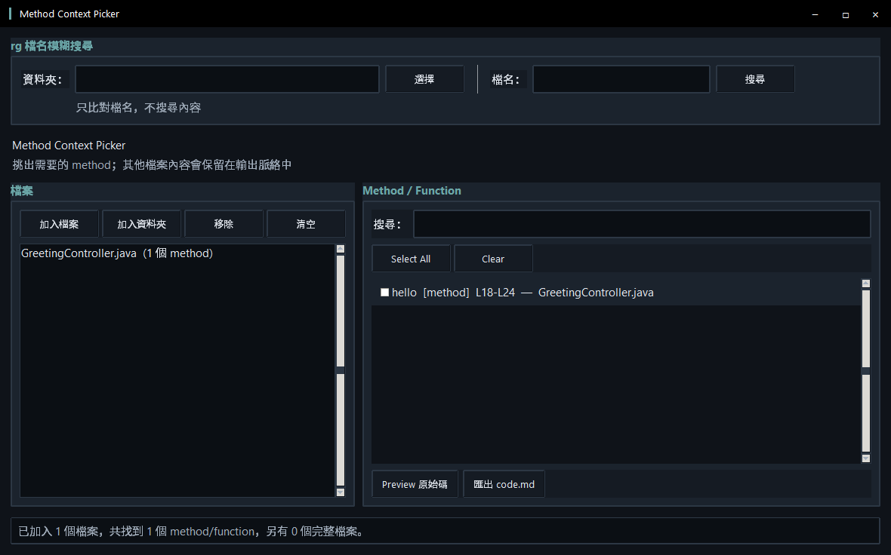
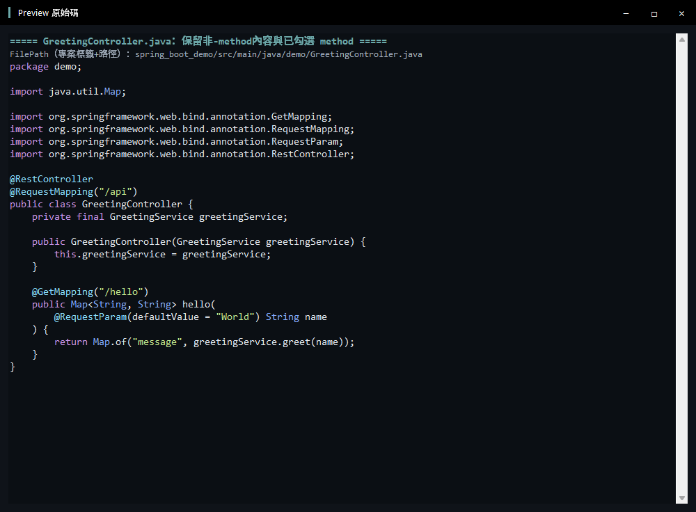

# Method Context Picker

這是一個純 Python、Tkinter 的小型 GUI，讓你從 Java / JavaScript 檔案中挑選需要的 method 或 function；JSP 則以完整檔案加入，再預覽或匯出成 `code.md`。

## 畫面預覽

### Method Context Picker



### Preview 原始碼



## 功能

- 加入多個 `.java`、`.js` 與 `.jsp` 檔案
- 加入資料夾並遞迴尋找所有 `.java` / `.js` / `.jsp` 檔案
- JSP 不解析 method，會自動以完整檔案保留與匯出
- 使用 `rg --files` 依檔名進行不分大小寫的模糊搜尋；沒有 rg 時自動退回 Python 搜尋
- 內建輕量解析器，自動列出常見 Java method、constructor、JavaScript function、class method 與 arrow function
- 搜尋 method 名稱、signature 或檔名
- `Select All`：勾選目前搜尋結果
- `Clear`：清除全部勾選
- `Preview 原始碼`：預覽已勾選的原始碼
- Preview 內建 IDE 風格語法配色：關鍵字、型別、字串、註解、數字與 annotation 分色
- 主視窗與 Preview 使用黑色自訂標題列、白色文字與視窗控制按鈕，和深色程式碼編輯區保持一致
- `匯出 code.md`：輸出含檔名、語言、行號與原始碼的 Markdown
- 輸出只提供不含本機使用者目錄的專案標籤加路徑 FilePath；package、import、annotation、class 宣告與欄位也會保留，只移除未勾選的其他 method
- 深色主題：以深色背景、青色 accent 與等寬程式碼預覽降低長時間閱讀負擔

本專案沒有第三方套件，不需要外部 parser、AI、Agent、向量資料庫或管理員權限。

## 直接使用

請在本資料夾開啟命令提示字元或終端機，執行：

```text
py main.py
```

如果你的 Python 啟動指令是 `python`，也可以執行：

```text
python main.py
```

操作順序：

1. 單檔或多檔加入時按「加入檔案」；要載入整個專案時按「加入資料夾」。
2. 選取 Java、JavaScript 或 JSP 檔案/資料夾，資料夾會自動遞迴掃描子資料夾。
3. 若要依檔名找檔案，在上方選擇資料夾並輸入關鍵字；搜尋只比對檔名，不讀取內容。
4. 在右側搜尋並勾選 Java/JavaScript method/function；JSP 不需勾選，會自動完整加入。
5. 用「Preview 原始碼」確認內容。
6. 按「匯出 code.md」選擇輸出位置。

## GUI 實測操作流程

以下流程使用內建的 `fixtures/` 測試資料，可在明天實際使用時照做：

1. 執行 `py main.py` 開啟 GUI。
2. 在上方「rg 檔名模糊搜尋」按「選擇」，指定專案根資料夾。
3. 輸入 `controller` 後按「搜尋」。搜尋結果會命中：
   `spring_boot_demo/src/main/java/demo/GreetingController.java`。
4. 右側會顯示 `hello` method；勾選後按「Preview 原始碼」。
5. Preview 會保留 `package`、`import`、annotation、class 欄位、constructor，並保留勾選的 `hello` method。
6. 按「匯出 code.md」，選擇輸出檔案位置。
7. 輸入 `jsp` 搜尋時，`example.jsp` 會顯示為「JSP 完整檔案」，不會出現 method checkbox，Preview／匯出會保留全文。

### 實測輸出摘要

```text
RG 命中：spring_boot_demo/src/main/java/demo/GreetingController.java
Method：hello
已選取 1 個 method/function。
FilePath（專案標籤+路徑）：spring_boot_demo/src/main/java/demo/GreetingController.java
JSP 完整檔案：example.jsp
```

檔名搜尋只比對檔名，不會因為資料夾名稱或檔案內容包含關鍵字而誤命中。

## 執行測試

```text
py run_tests.py
```

或：

```text
py -m unittest discover -s tests -v
```

測試 fixture 放在 `fixtures/`，包含 Java constructor、annotation、multiline signature、JavaScript function、class method、async method、block arrow function、expression arrow function、JSP 完整檔案，以及註解/字串中的假函式文字。`fixtures/spring_boot_demo/` 另外提供一個簡單的 Spring Boot Controller + Service + Application 案例，可一次加入多個 `.java` 檔案測試實際工作情境。

## 專案結構

```text
method_context_picker/
├─ main.py                         # GUI 啟動入口
├─ run_tests.py                    # 測試啟動入口
├─ method_context_picker/
│  ├─ __init__.py
│  ├─ app.py                       # Tkinter GUI
│  ├─ search_app.py                # 檔名搜尋入口
│  ├─ filename_search.py           # rg / Python 檔名搜尋
│  ├─ exporter.py                  # Markdown 匯出
│  ├─ models.py                    # MethodInfo 資料模型
│  └─ parsers.py                   # Java / JavaScript 內建解析器
├─ fixtures/
│  ├─ Example.java
│  └─ example.js
└─ tests/
   ├─ __init__.py
   ├─ test_exporter.py
   ├─ test_filename_search.py
   └─ test_parsers.py
```

## 解析範圍與限制

第一版刻意採輕量啟發式解析，目標是明天可用、容易 debug、無安裝成本。它會遮罩註解與字串，再依大括號取得 method 範圍；因此適合一般 Java / JavaScript source。

這不是完整 AST parser。Java constructor 會被視為 class 上下文而保留，不列入可刪除的 method 清單。極度特殊的語法，例如複雜 JavaScript destructuring、template literal interpolation 內再放函式、或尚未輸入完成的大括號，可能需要之後再補規則。遇到未完成的大括號時，該候選會略過，其他檔案仍可正常使用。

## 明天使用前的最小驗證

先執行 `py run_tests.py`；測試全部通過後，再執行 `py main.py` 加入你的實際 Java 檔案，確認搜尋、預覽與匯出各操作一次即可。
